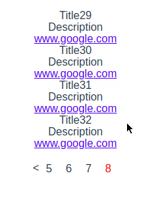

# vuejs-pagination

> A Vue.js pagination

### Demo

[Demo](https://volokolamskspb.github.io/Custom-pagination-on-VueJs/)


## Build Setup

``` bash
# install dependencies
npm install

# serve with hot reload at localhost:8080
npm run dev

# build for production with minification
npm run build

# build for production and view the bundle analyzer report
npm run build --report
```

For a detailed explanation on how things work, check out the [guide](http://vuejs-templates.github.io/webpack/) and [docs for vue-loader](http://vuejs.github.io/vue-loader).


### Options

You can pass following options:

* rightIcon - String which contains Symbol or HTML tag which represents right Arrow
* leftIcon - String which contains Symbol or HTML tag which represents right Arrow
* results - Array of Objects which contains articles. Each article contains `title`, `description` and `url` values. You can modify those values in `Results.vue` component
* maxAmountOfPages - Number, maximum amount of pages showed on 1 page
* perPage - Number, amount of articles, showed per page

Example:

```vue
    <Pagination
      :rightIcon="rightIcon"
      :leftIcon="leftIcon"
      :results="results"
      :maxAmountOfPages="maxAmountOfPages"
      :perPage="perPage"
    />
```

